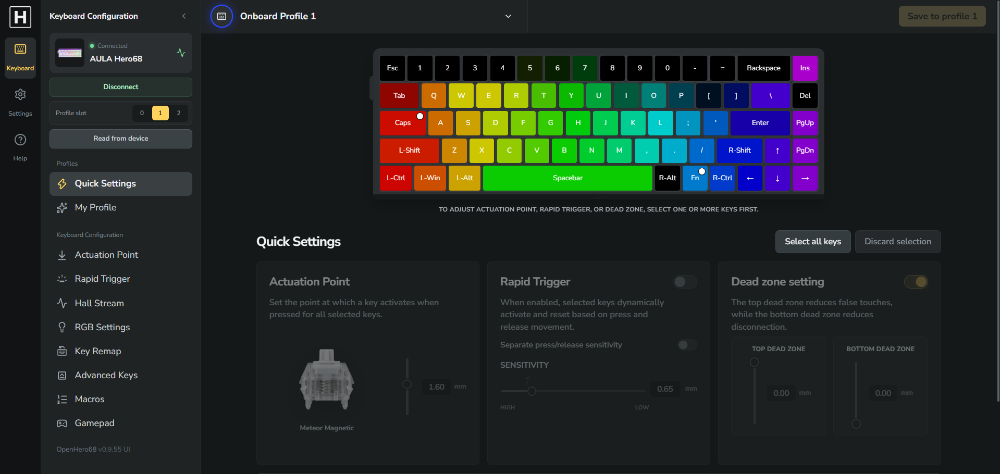
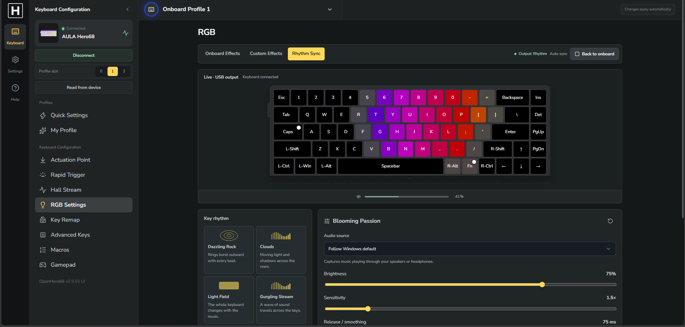

# OpenHero68

An open-source, browser-based configurator for the **AULA HERO68** Hall-effect keyboard, plus an optional **Windows tray service** that keeps custom RGB, Rhythm Sync and analog Xbox gamepad output running after the browser is closed.

[**Open the web app**](https://open-hero68.pages.dev/) · [**Download the Windows service**](https://github.com/shizunavn/OpenHero68/releases/latest/download/OpenHero68-RGB-Windows-x64.zip) · [Release notes](https://github.com/shizunavn/OpenHero68/releases/latest)



> **Unofficial project.** OpenHero68 is a community effort based on reverse engineering. It is not affiliated with or endorsed by AULA or the makers of Wootility.

## Contents

- [Features](#features)
- [Quick start](#quick-start)
- [RGB tray service (Windows)](#rgb-tray-service-windows)
- [Development](#development)
- [Building the Windows service](#building-the-windows-service)
- [Project structure](#project-structure)
- [Documentation](#documentation)
- [Status and known limitations](#status-and-known-limitations)
- [Contributing](#contributing)

## Features

**Web app** (Chrome or Edge, via WebHID — no driver or install needed)

| Area | What you can do |
| --- | --- |
| Profiles | Switch between 3 on-board profile slots, read from and save to the device |
| Actuation Point | Per-key or multi-key actuation from 0.10 to 3.40 mm, with a live Hall test overlay on the keyboard |
| Rapid Trigger | Rapid Trigger and deadzone settings |
| Key Remap | Remap keys across layers, with a searchable icon catalog |
| Advanced Keys | SOCD, DKS, Mod Tap, Toggle, MPT and END bindings (Main Layer) |
| Macros | Macro editor with a local library synced to the keyboard |
| RGB Settings | On-board effects for keys and side light, plus **Custom Effects** and **Rhythm Sync**; per-key painting tools sit directly below the keyboard preview |
| Gamepad | Setup & Remap with automatic saves, analog response curves/travel, digital AP/RT, Snappy, circle/square, angle adjustment and a live tester with XInput verification |
| Device settings | Polling rate (125 Hz – 8000 Hz), Tachyon Mode, OS mode, Windows key lock, Hall debounce, auto calibration, switch selector |
| Interface | English and Vietnamese UI, optional advanced pages (Hall Stream), compact sidebar |

**RGB tray service** (Windows x64, portable)

- **Custom Effects:** an Aurora base with composable effects (Comet, Pressure Wave, Ripple, Reaction, Touch, Jelly, AOE, Scan, Breath, Mixing, Trail, RT Display) and a layer editor. Start/Stop controls with automatic live updates, session recovery and preserved drafts.
- **Rhythm Sync:** seven key modes driven by native system-audio capture, with live preview and a 60 FPS USB scheduler shared with Custom Effects.
- **Gamepad:** one virtual Xbox controller through ViGEmBus 1.22.0, up to 200 Hz analog output, automatically saved configurations for three HERO68 profiles and tray Start/Stop. Curve edits save on release; digital buttons follow keyboard AP/RT. The tester has a separate fast input stream; assigned keyboard keys can use firmware empty action with automatic remap recovery.
- **Shared Hall:** one native scheduler polls active source keys only, sharing common samples between Gamepad, RGB, Hall Stream and visual feedback. RGB Hall demand stays 100 Hz; LED output retains its 60 FPS target.
- **Keeps playing** when the browser is closed; AP, Rapid Trigger and deadzone stay editable while RGB runs.
- **Try demo:** edit and preview effects locally without the service or a keyboard.
- No Node.js, Python or administrator rights are needed on the user's PC.

## Quick start

### Just want to use it?

1. Open **<https://open-hero68.pages.dev/>** in Chrome or Edge.
2. Click **Connect** and select the HERO68 keyboard.
3. Change settings, then click **Save to profile N**.

Close other keyboard configuration apps (for example the vendor software) while connecting, as only one app can own the HID connection at a time.

For Custom Effects, Rhythm Sync and Gamepad, also install the [tray service](#rgb-tray-service-windows). Gamepad additionally needs the separately installed official [ViGEmBus 1.22.0 driver](https://github.com/nefarius/ViGEmBus/releases/tag/v1.22.0); driver installation requires administrator rights. Ordinary keyboard input stays enabled. Enable advanced pages to show Gamepad, bind controls and enable it; release all assigned keys before using the controller.

### Want to run it from source?

Requires **Node.js 22.12 or later**.

```sh
npm ci
npm run dev
```

Open the HTTPS URL printed by Vite. WebHID requires a secure context, so Vite creates a local development certificate; accept the browser warning.

## RGB tray service (Windows)

1. Download the Windows x64 ZIP from [Releases](https://github.com/shizunavn/OpenHero68/releases/latest) and extract it to a **permanent folder**. Keep all included files together.
2. Run `Hero68RgbService.exe`. An **H** icon appears in the system tray.
3. Open the web app and choose **Allow** if the browser asks for access to apps and services on this device.
4. Go to **RGB Settings → Custom Effects** or **Rhythm Sync**, pick a preset and click **Start Custom** or **Start Rhythm Sync**. Running edits sync automatically; returning to the editor joins existing playback.
5. Close the browser if you like — playback continues. Right-click the tray icon for controls.

**Tray menu:** Open web app · Open control panel · Start saved RGB · Stop RGB · Start saved Gamepad · Stop Gamepad · Check for updates · Open log folder · Auto-start · Quit.

Gamepad starts disabled whenever the service starts. Once enabled, it keeps running when the browser closes. Its independent 50 ms watchdog neutralizes stale input and waits for all assigned keys to rest before rearming.

| | |
| --- | --- |
| Control panel | <http://127.0.0.1:16868/> |
| Presets and logs | `%LOCALAPPDATA%\OpenHero68\rgb-service` |
| Auto-start | Optional, per Windows account, off by default. Disable it before moving or deleting the folder. |
| Allowed origins | The deployed web app and `localhost:5173`. For another host, start the service with `--allow-origin https://your-host:port`. |

### Updating

- **Check for updates** in the tray downloads and applies compatible signed core updates automatically.
- When the native launcher/helper changes, install the **complete Windows ZIP**: quit the old app, extract all files over its folder, then start the new launcher. A core-only update is insufficient for native changes.
- The current digital Gamepad AP/Rapid Trigger behavior requires **core 0.4.6, launcher 0.4.6 and API 6**. Install the complete package when upgrading an older service.
- If an older installation reports `Unexpected update source`, download a current complete ZIP from [Releases](https://github.com/shizunavn/OpenHero68/releases/latest). See the [changelog](CHANGELOG.md) for version-specific migration notes.
- If Auto-start points to an old folder, use **Auto-start: replace old app path** in the new tray menu.

## Development

Production builds and tests require development dependencies. Use `npm ci` (or
`npm ci --include=dev` if your environment defaults to omitting them) before
building; the resulting `dist/` contains static browser assets.

Copy `.env.example` to `.env.local` to configure `HERO68_DEV_HOSTS`: optional
comma-separated hostnames/IPs added to the local Vite certificate. Localhost and
127.0.0.1 remain available without configuration.

Set `HERO68_ALLOWED_ORIGINS` in the **service process environment** to allow
additional exact HTTP(S) origins, separated by commas. Paths, credentials and
wildcards are rejected. The service does not load Vite's `.env.local`; its
deployed Pages and localhost defaults remain available, and `--allow-origin`
still adds origins explicitly. These variables are not exposed to browser code.

| Command | Description |
| --- | --- |
| `npm run dev` | Start the Vite dev server over HTTPS |
| `npm run build` | Type-check and build the web app into `dist/` (serve it over HTTPS for WebHID) |
| `npm run preview` | Preview the production build |
| `npm test` | Run all tests (`node --test tests/*.test.mjs`) |
| `npm run test:rgb` | Run only the RGB tests |
| `npm run test:profile-remap` | Run only the profile/remap tests |
| `npm run build:service` | Type-check and bundle the service's TypeScript into `service/dist/` |

Tech stack: React, TypeScript, Vite, WebHID; the service uses a bundled Node runtime with a native C++ launcher and HID bridge.

### Cloudflare Pages ZIP deployment

Run `npm ci`, `npm run build` and `node tools/package-pages.mjs`, then upload
`open-hero68-pages.zip` through the Cloudflare Pages dashboard. The packaging
script generates `_worker.js` and `_routes.json` from `functions/api/region.js`;
do not put generated copies in `public/`. A bare `dist/` upload does not include
the region endpoint. Use the same ZIP workflow for Preview before Production,
then check `/api/region` and `/api/region/` return JSON. Access-protected previews
require sign-in before checking the endpoint.

## Building the Windows service

Requires Windows with **Visual Studio Build Tools** (C++ desktop workload and Windows SDK).

```powershell
$env:HERO68_VCVARS = 'C:\path\to\VC\Auxiliary\Build\vcvars64.bat'
npm ci
npm run build:service
node tools/package-rgb-service.mjs
```

The launcher and HID bridge are compiled with MSVC. The TypeScript RGB engine and the Node runtime are bundled into `service/dist/`. Packaging writes a ZIP and a SHA256 checksum to `service/releases/`. A locally built ZIP does not change the GitHub "latest" download until it is published.

Helper scripts in `tools/` cover verification (`verify-service-package.mjs`, `verify-service-live.mjs`, …), benchmarking, signing and release publishing.

## Project structure

```text
src/
  App.tsx            Main shell: rail, sidebar, pages
  assets/fonts/      Bundled Nunito Sans variable font subsets
  styles/            Ordered shared stylesheets
  components/        Feature pages (remap, macros, RGB, advanced keys, …)
  app/               Shared UI pieces, hooks and helpers
  keyboard/          HERO68 layout and RGB/preview models
  protocol/          WebHID transport and the HERO68 protocol (hero68/)
  state/             Persisted app state, macros, remap presets
  i18n/              English / Vietnamese translations
functions/           Cloudflare Pages Functions (region detection)
public/              Optional static files copied by Vite (create as needed)
service/             Tray service: TypeScript core + native C++ (native/)
tools/               Build, packaging, verification and release scripts
tests/               Automated tests and fixtures
docs/                Reverse-engineering notes, feature docs, release notes
```

## Documentation

- [Custom RGB and the background service](docs/CUSTOM_RGB.md)
- [Rhythm Sync](docs/RHYTHM_SYNC.md)
- [Gamepad and shared Hall](docs/GAMEPAD.md) · [Recorded validation results](docs/GAMEPAD_VALIDATION.md)
- [Macros UI](docs/MACRO_UI.md) · [Advanced Keys UI](docs/ADVANCED_KEYS_UI.md)
- [Protocol integration notes](src/protocol/README.md)
- [All docs, including reverse-engineering notes](docs/README.md)
- [Changelog](CHANGELOG.md) · [Service release notes](docs/releases/)

## Status and known limitations

The project is under active development.

- **Gamepad v1** supports one HERO68 and one Xbox controller on Windows x64. Firmware blocking saves exact original remaps before writing zero and recovers them after service restart. Advanced Keys on assigned keys must be removed first. Windows hook fallback affects matching keys on other keyboards, may not block Raw Input, and displays an anti-cheat warning when selected. No suppression method guarantees anti-cheat approval. DirectInput, mouse-to-stick and kernel keyboard filters are outside v1. Physical unplug/replug and sleep/wake remain unverified
- **Rhythm side-light modes** work in the demo only. Live side output stays disabled until the HERO68 LED count, order and protocol are verified; side LEDs keep their on-board effect while key playback runs.
- **Tachyon Mode** (8000 Hz polling) turns key and side lighting off to minimize latency. Custom Effects, Rhythm Sync and automatic Hall polling are paused while it is on, and your previous lighting is restored when you turn it off.
- The tray service supports **Windows x64 only**. The web app needs a WebHID browser (Chrome or Edge).

## Contributing

Issues and pull requests are welcome. Before opening a pull request, run:

```sh
npm run build
npm test
```

When reporting a bug, please include your browser, Windows version, service version and the logs from `%LOCALAPPDATA%\OpenHero68\rgb-service`.

## License

APACHE 2.0
